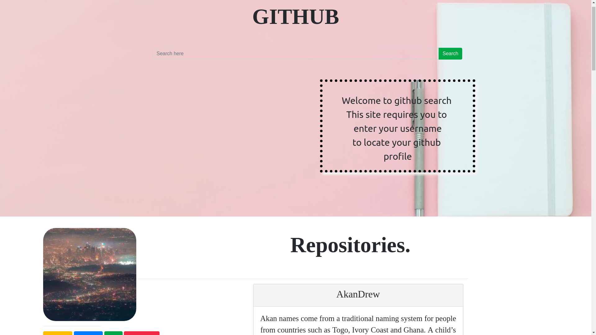

## Project Name
- Github  search
## Author
- ANDREW ODONGO
## Description

- The website works in a way that one searches a Github account, get to explore and view  account in Github.
- The project  uses the github API to collect information that are required;
 When you enter the github name you see some of the profile of the github repository. 

## Technologies Used
- This project was generated with Angular CLI version 13.5.0
- HTML & CSS (Bootstrap)
## Setup Instructions and Installation
- Clone this repository to a location in your file system.
- Open terminal command line then navigate to the root folder of the application.
- Run ng serve command.
- Navigate to http://localhost:"place the port given here I.E :4200"/ in your browser.

## BDD

 1. Displays GitHub info of a user when user name is entered
   - INPUT: "user name entered"
   - OUTPUT: "Displays User Details"
 2. View default git profil
 3. view followers and following  

## Development

- To fix a bug or enhance an existing module, follow these steps:

1. Fork the repo
2. Create a new branch (git checkout -b <branch-name>)
3. Make the appropriate changes in the files
4. Add changes and Commit your changes (git commit -am "<change-description>")
6. Push to the branch (git push origin <branch-name>)
7. Create a Pull Request

## Development server

Run `ng serve` for a dev server. Navigate to `http://localhost:4200/`. The app will automatically reload if you change any of the source files.

## Code scaffolding

Run `ng generate component component-name` to generate a new component. You can also use `ng generate directive|pipe|service|class|guard|interface|enum|module`.

## Build

Run `ng build` to build the project. The build artifacts will be stored in the `dist/` directory. Use the `--prod` flag for a production build.

## Running unit tests

Run `ng test` to execute the unit tests via [Karma](https://karma-runner.github.io).

## Running end-to-end tests

Run `ng e2e` to execute the end-to-end tests via [Protractor](http://www.protractortest.org/).

## Further help

To get more help on the Angular CLI use `ng help` or go check out the [Angular CLI README](https://github.com/angular/angular-cli/blob/master/README.md).

## Contacts

Tell:+254740478651
Email:drewodong470@gmail.com

## license
[MIT License](https://andrew1440.github.io/Gitsearch/blob/master/LICENSE) [andrew1440](https://github.com/andrew1440). 
